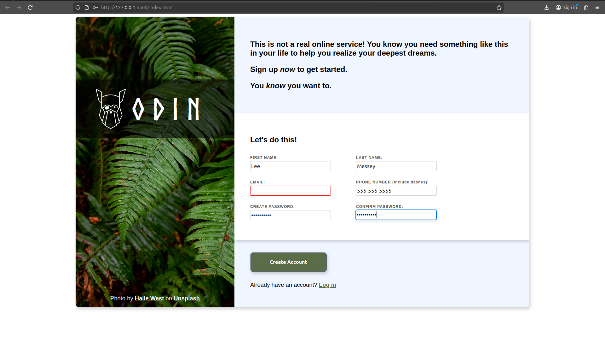

# Odin Sign-Up Form

A sign-up page I built for **The Odin Project – Intermediate HTML & CSS** curriculum.  
This is a fake online service sign-up form that focuses on layout, typography, and basic client-side form validation.

**Live Link:** https://leemassey-playground.github.io/odin-sign-up-form/

---

## Features

- **Two-column layout**
  - Left sidebar with full-height background image and Odin logo.
  - Right column containing the sign-up form and copy.

- **Custom branding**
  - Norse-style logo text using a self-hosted `@font-face` font.
  - Soft color palette and subtle box shadows for a modern card feel.

- **Form fields**
  - First Name
  - Last Name
  - Email
  - Phone Number (US format: `123-456-7890`)
  - Password
  - Confirm Password
  - “Create Account” button and “Already have an account?” link

- **HTML5 validation**
  - `required` attributes on all inputs.
  - `type="email"` for email validation.
  - `type="tel"` plus a `pattern` for phone numbers (`[0-9]{3}-[0-9]{3}-[0-9]{4}`).
  - Uses the `:user-invalid` pseudo-class to highlight invalid fields in red.
  - Custom focus styling with box shadow for active inputs.

---

## Technologies Used

- **HTML5**
- **CSS3** (Flexbox for layout)
- **Custom @font-face** for the Odin logo

---

## What I Practiced / Learned

- Structuring a semantic HTML form.
- Building a **side-by-side layout** using Flexbox.
- Using `@font-face` to load a local webfont and combining it with Google Fonts.
- Applying **HTML5 form validation** attributes (`required`, `type`, `pattern`) and styling invalid/active states.
- Creating a “card” style container with **box shadows, border-radius, and overflow control**.
- Working with background images (cover, positioning) and image credits.

---

## How to Run the Project

1. Click the live demo link near the top of this README file.
2. Clone or download the repository.
3. Open `index.html` in your browser  
   – or run a simple live server (for example, the VS Code Live Server extension).
4. Try submitting the form with empty or invalid fields to see the validation styles.

---

## Possible Improvements

- Add JavaScript to:
  - Show live feedback when passwords don’t match.
  - Display custom validation messages instead of the browser defaults.
- Improve accessibility:
- Make the layout fully responsive on very small screens (mobile-first refinements).

---

## Credits

- **Design/Code:** Lee Massey (as part of [The Odin Project](https://www.theodinproject.com/) curriculum)
- **Background Photo:** [Halie West](https://unsplash.com/@haliewestphoto) on [Unsplash](https://unsplash.com/)
- **Odin Logo Font:** Norse (used via self-hosted `@font-face`)